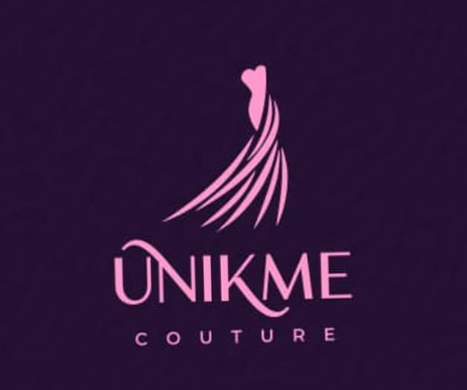

# Brielle Elan Website

A premium Nigerian fashion brand website celebrating African heritage with contemporary designs.



## Overview

UNIKME Couture is a sophisticated e-commerce website showcasing premium Nigerian fashion that blends traditional African textiles with modern design aesthetics. The website serves as the digital storefront for wedding dresses, kids outfits, and unique African-inspired clothing.

## Features

### 🎨 Design & User Experience
- **Responsive Design**: Fully responsive layout optimized for desktop, tablet, and mobile devices
- **Modern UI/UX**: Clean, contemporary interface with smooth animations and transitions
- **Typography**: Premium font combination using Montserrat and Playfair Display
- **Visual Appeal**: High-quality imagery with hover effects and interactive elements

### 🛍️ E-commerce Functionality
- **Product Collections**: Organized sections for Wedding Dresses, Kids Outfits, and Unique Outfits
- **Featured Products**: Highlighted product showcase with quick view functionality
- **Navigation**: Intuitive menu structure with dropdown categories
- **Shopping Features**: Product grid layout with hover effects and pricing display

### 📱 Interactive Elements
- **Dropdown Menus**: Hover-activated navigation dropdowns
- **Mobile Menu**: Collapsible mobile navigation for smaller screens
- **Smooth Scrolling**: Enhanced user experience with smooth page transitions
- **Newsletter Signup**: Email subscription form for customer engagement

### 🏪 Business Sections
- **Hero Section**: Compelling banner with call-to-action
- **About Us**: Company story and brand philosophy
- **Contact Information**: Complete business details and location
- **Social Media Integration**: Links to Instagram and other platforms

## Technology Stack

### Frontend Technologies
- **HTML5**: Semantic markup structure
- **CSS3**: Custom styling with advanced features
- **JavaScript**: Interactive functionality and DOM manipulation
- **Tailwind CSS**: Utility-first CSS framework via CDN
- **Font Awesome**: Icon library for UI elements
- **Google Fonts**: Premium typography (Montserrat & Playfair Display)

### External Resources
- **Tailwind CSS CDN**: `https://cdn.tailwindcss.com`
- **Font Awesome CDN**: `https://cdnjs.cloudflare.com/ajax/libs/font-awesome/6.4.0/css/all.min.css`
- **Google Fonts**: Custom font loading
- **Unsplash Images**: High-quality stock photography

## File Structure

```
project-root/
│
├── index.html              # Main website file
├── files/
│   ├── favicon2.png        # Website favicon
│   ├── Logo.png           # UNIKME Couture logo
│   ├── slide1.jpg         # Wedding dresses collection image
│   ├── slide2.jpg         # Unique outfits collection image
│   └── slide3.jpg         # Kids outfits collection image
└── README.md              # Project documentation
```

## Setup & Installation

### Prerequisites
- Modern web browser (Chrome, Firefox, Safari, Edge)
- Local web server (optional, for development)

### Quick Start
1. **Download/Clone** the project files
2. **Ensure file structure** matches the layout above
3. **Open** `index.html` in your web browser
4. **Verify** all images and assets load properly

### Development Setup
```bash
# For local development server (optional)
# Using Python
python -m http.server 8000

# Using Node.js (if you have it installed)
npx serve .

# Using PHP
php -S localhost:8000
```

## Configuration

### Image Assets
Ensure the following image files are present in the `files/` directory:
- `favicon2.png` - Website favicon
- `Logo.png` - Company logo
- `slide1.jpg` - Wedding dresses collection
- `slide2.jpg` - Unique outfits collection  
- `slide3.jpg` - Kids outfits collection

### Customization Options
- **Colors**: Modify the color scheme in CSS custom properties
- **Fonts**: Update font families in the Google Fonts import
- **Content**: Edit text content directly in HTML
- **Images**: Replace placeholder images with actual product photos

## Browser Compatibility

- ✅ Chrome (latest)
- ✅ Firefox (latest)
- ✅ Safari (latest)
- ✅ Edge (latest)
- ✅ Mobile browsers (iOS Safari, Chrome Mobile)

## Performance Features

- **Optimized Images**: Proper image sizing and compression
- **CDN Resources**: Fast loading external resources
- **Minimal JavaScript**: Lightweight interactive features
- **CSS Optimization**: Efficient styling with Tailwind utilities

## SEO Features

- **Meta Tags**: Proper title and viewport configuration
- **Semantic HTML**: Structured markup for search engines
- **Alt Attributes**: Image accessibility and SEO
- **Clean URLs**: SEO-friendly navigation structure

## Contact Information

**UNIKME Couture**
- 📍 Address: 123 Fashion Avenue, Ikorodu, Lagos, Nigeria
- 📞 Phone: +234 812 345 6789
- 📧 Email: hello@UnikmeCouture.com
- 📱 Instagram: [@unikme_couture](https://www.instagram.com/unikme_couture/)

## Business Focus

### Target Market
- Nigerian fashion enthusiasts
- Wedding dress shoppers
- Parents seeking quality kids clothing
- Customers appreciating African-inspired designs

### Product Categories
1. **Wedding Dresses** - Elegant designs inspired by Nigerian culture
2. **Kids Outfits** - Sophisticated styles with African influences  
3. **Unique Outfits** - Handcrafted pieces with contemporary flair

## Future Enhancements

### Planned Features
- [ ] E-commerce shopping cart functionality
- [ ] User account system and authentication
- [ ] Payment gateway integration
- [ ] Product review and rating system
- [ ] Advanced search and filtering
- [ ] Multi-language support
- [ ] Blog/Journal section expansion

### Technical Improvements
- [ ] Progressive Web App (PWA) capabilities
- [ ] Advanced image optimization
- [ ] Database integration for dynamic content
- [ ] Admin panel for content management

## License

© 2025 UNIKME Couture. All rights reserved.

## Support

For technical issues or business inquiries:
- Email: hello@UnikmeCouture.com
- Instagram: @unikme_couture

---

*Built with passion for African fashion and modern web technologies.*

